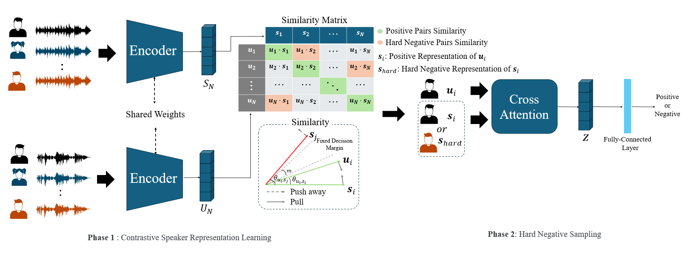

# Contrastive Speaker Representation Learning with Hard Negative Sampling for Speaker Recognition

# Introduction

This repository provides a PyTorch implementation of speaker recognition framework

This repository is modified based on : [ECAPA-TDNN](https://github.com/taoruijie/ecapa-tdnn)
# Dependencies

- Python3
- Numpy
- PyTorch
- librosa
- tqdm
- torchaudio
- ECAPA-TDNN
- Resnet
- Tdnn
- Contrative Language-Image Pretraining(CLIP)
- Hard Negative Sampling

# Data preparation
Please follow the official code to perpare your VoxCeleb2 dataset from the 'Data preparation' part in this repository : [voxceleb_trainer](https://github.com/clovaai/voxceleb_trainer).

Dataset for training usage:

1. VoxCeleb2 training set;

2. MUSAN dataset;

3. RIR dataset.

Dataset for test usage:

1. Voxceleb1-O

2. Voxceleb1-E

3. Voxceleb1-H


# Pretrained models

We provide the following pre-trained ECAPA-TDNN: [ECAPA-TDNN_pretrained_weight](https://drive.google.com/drive/folders/1cszCCaU2NpIZtliy92VfD0I89Zxn6cNK?usp=drive_link)

# Extract speaker embedding
If you are using our code to extract speaker embeddings, use it like this:

```python
 import model
 import torch
 import torch, sys, os, tqdm, numpy, soundfile, time, pickle
 import torchaudio.transforms as T
 import torch.nn.functional as F
 
 use_cuda = torch.cuda.is_available() and True
 device = torch.device("cuda" if use_cuda else "cpu")
 
 speaker_encoder = model.ECAPA_TDNN(512, 16000).to(device)
 
 loaded_state = torch.load('/path/ecapa-tdnn.model')
 self_state = speaker_encoder.state_dict()
 new_state_dict = {name.replace("speaker_encoder.", ""): param for name, param in loaded_state.items()}
 new_state_dict.pop('speaker_loss.weight')
 
 speaker_encoder.load_state_dict(new_state_dict)
 sampling_rate = 16000
 audio_path = 'your audio path'
 audio, sr  = soundfile.read(os.path.join(audio_path))
 
 audio = torch.FloatTensor(audio)
 resampler = T.Resample(sr, sampling_rate, dtype=audio.dtype)
 audio = resampler(audio)

 with torch.no_grad():
     speaker_encoder.eval()
     embedding = speaker_encoder(audio.unsqueeze(0).to(device), False)
     embedding = F.normalize(embedding, p=2, dim=1)
 print(embedding.shape)
```

# Cosine similarity between speaker embeddings
This is a method of measuring cosine similarity between two utterances.

```python
sampling_rate = 16000
audio_path1 = 'audio path1'
audio_path2 = 'audio path2'

audio1, sr  = soundfile.read(os.path.join(audio_path1))
audio2, sr  = soundfile.read(os.path.join(audio_path2))

audio1 = torch.FloatTensor(audio1)
resampler = T.Resample(sr, sampling_rate, dtype=audio.dtype)
audio1 = resampler(audio1)

audio2 = torch.FloatTensor(audio2)
resampler = T.Resample(sr, sampling_rate, dtype=audio.dtype)
audio2 = resampler(audio2)

with torch.no_grad():
    speaker_encoder.eval()
    embedding_11 = speaker_encoder(audio1.unsqueeze(0).to(device), False)
    embedding_11 = F.normalize(embedding_11, p=2, dim=1)
    
    embedding_21 = speaker_encoder(audio2.unsqueeze(0).to(device), False)
    embedding_21 = F.normalize(embedding_21, p=2, dim=1)

score = F.cosine_similarity(embedding_11.to(device), embedding_21.to(device))

print(score)
```

# Training 

you must change the data path in the `trainECAPAModel.py`

```sh
!CUDA_VISIBLE_DEVICES=0 python trainECAPAModel.py \
--sampling_rate sampling rate \ # audio resampling
--eval_list /path/veri_test2.txt \ # validation dataset path
--save_path /path/model/save/directory \ # model save path
--mode blip \ # training method(classifier, clip, blip)
--loss aam_infonce \ # loss function(infonce, aam_infonce)
--model tdnn \ # model(ECAPA-TDNN, Resnet, Tdnn)
--initial_model /path/model/save/saved_weight.model \ # load pretrained weight
```
    
This repository provides code to train three models : (ECAPA-TDNN, Resnet, Tdnn) using the classification approach and contrastive learning approach.        
The result will be saved in `/path/model/save/directory/score.txt` The model will saved in `/path/model/save/model`

- Example of `classification approach` ECAPA-TDNN with AAM-Softmax :

```bash
!CUDA_VISIBLE_DEVICES=0 python trainECAPAModel.py \
    --sampling_rate 16000 \
    --eval_list /path/veri_test2.txt \
    --save_path /path/model/save/directory \ 
    --mode classifier \
    --model ecapa-tdnn \
    --initial_model /path/model/save/saved_weight.model \
```

- Example of `constrastive learning approach(CLIP)` training ECAPA-TDNN with InfoNCE  :

```bash
!CUDA_VISIBLE_DEVICES=0 python trainECAPAModel.py \
    --sampling_rate 16000 \
    --eval_list /path/veri_test2.txt \
    --save_path /path/model/save/directory \ 
    --mode clip \
    --loss infonce \ 
    --model ecapa-tdnn \
    --initial_model /path/model/save/saved_weight.model \
```

- Example of `constrastive learning approach(with hard negative sampling)` training ECAPA-TDNN with InfoNCE  :

```bash
!CUDA_VISIBLE_DEVICES=0 python trainECAPAModel.py \
    --sampling_rate 16000 \
    --eval_list /path/veri_test2.txt \
    --save_path /path/model/save/directory \ 
    --mode blip \
    --loss aam_infonce \ 
    --model ecapa-tdnn \
    --initial_model /path/model/save/saved_weight.model \
```
         
# Inference

The following is a usage of performing performance evaluation of EER and min-dcf. In the case of `--snorm`, AS-Norm is performed.

```bash
!CUDA_VISIBLE_DEVICES=0 python trainECAPAModel.py \
    --eval \
    #--snorm \ 
    --sampling_rate 16000 \
    --eval_list /path/veri_test2.txt \
    #--train_list /path/train_vox2.txt \
    #--train_path /path/dev/aac/ \
    --initial_model /path/model/save/saved_weight.model
```

With AS-norm, this system performs EER: 0.86. We will not update this code recently since no enough time for this work. I suggest you the following paper if you want to add AS-norm or other norm methods:
In the case of AS-Norm, it takes a lot of time, and in our case, it took more than 24 hours on Nvidia A5000.

# Acknowledge
Thanks to the following projects:

[voxceleb_trainer](https://github.com/clovaai/voxceleb_trainer)
[ECAPA-TDNN_pretrained_weight](https://drive.google.com/drive/folders/1cszCCaU2NpIZtliy92VfD0I89Zxn6cNK?usp=drive_link)

This work was partially supported by the Institute of Information & Communications Technology Planning & Evaluation (IITP) grant funded by the Korean government (MSIT) (No. 2022-0-00963, Localization Technology Development on Spoken Language Synthesis and Translation of OTT Media Content), and by a research fund from Chosun University, 2023
